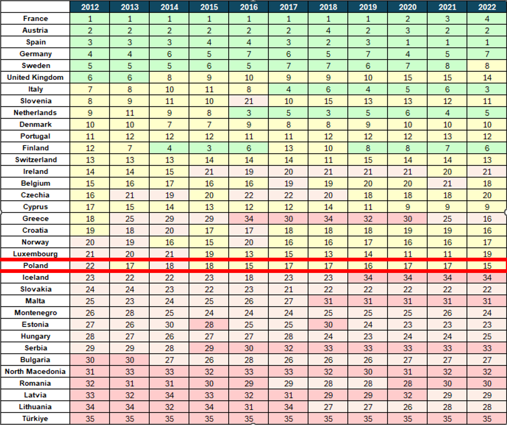

```{r setup, include=FALSE, tidy = TRUE}
knitr::opts_chunk$set(echo = TRUE)
```

```{r , warning=FALSE , echo =FALSE, message=FALSE}
# projekt Rodzicielstwo NAWNE 

library(readxl)
library(dplyr)
library (ggplot2)
library("ggrepel")
library("sf")
library("rnaturalearth")
library("rnaturalearthdata")

library(fmsb)
library(grDevices)

# Wczytanie danych
R12 <- read_excel("C:/Users/olgas/OneDrive/Documents/Tabela_glowna.xlsx", 
                            sheet = "2012")
R13 <- read_excel("C:/Users/olgas/OneDrive/Documents/Tabela_glowna.xlsx", 
                            sheet = "2013")
R14 <- read_excel("C:/Users/olgas/OneDrive/Documents/Tabela_glowna.xlsx", 
                            sheet = "2014")
R15 <- read_excel("C:/Users/olgas/OneDrive/Documents/Tabela_glowna.xlsx", 
                            sheet = "2015")
R16 <- read_excel("C:/Users/olgas/OneDrive/Documents/Tabela_glowna.xlsx", 
                            sheet = "2016")
R17 <- read_excel("C:/Users/olgas/OneDrive/Documents/Tabela_glowna.xlsx", 
                            sheet = "2017")
R18 <- read_excel("C:/Users/olgas/OneDrive/Documents/Tabela_glowna.xlsx", 
                            sheet = "2018")
R19 <- read_excel("C:/Users/olgas/OneDrive/Documents/Tabela_glowna.xlsx", 
                            sheet = "2019")
R20 <- read_excel("C:/Users/olgas/OneDrive/Documents/Tabela_glowna.xlsx", 
                            sheet = "2020")
R21 <- read_excel("C:/Users/olgas/OneDrive/Documents/Tabela_glowna.xlsx", 
                            sheet = "2021")
R22 <- read_excel("C:/Users/olgas/OneDrive/Documents/Tabela_glowna.xlsx", 
                            sheet = "2022")

## Tworzenie wykresu radarowego ##

# Zmiana destymulant na stymulanty

# Funkcja standaryzująca 
Stan <- function(x) {
  (x - mean(x))/sd(x)
}

R12_zapas <- R12[,-c(1)]
R22_zapas <- R22[,-c(1)]

# Standaryzacja #
R12_zapas <- R12_zapas %>% mutate_all(Stan)
R22_zapas <- R22_zapas %>% mutate_all(Stan)

# Zamiana wzorem y = -x tylko destymulanty

for (i in c(1, 4, 5, 7, 8, 9,10)) {
  R12_zapas[R12_zapas[, i] != 0, i] <- -1 *R12_zapas[R12_zapas[, i] != 0, i]
  R22_zapas[R22_zapas[, i] != 0, i] <- -1 * R22_zapas[R22_zapas[, i] != 0, i]
}

mean_R12 <- colMeans(R12_zapas)
mean_R22 <- colMeans(R22_zapas)


########################################################

# Funkcja standaryzująca 
Stan <- function(x) {
  (x - mean(x))/sd(x)
}

# Funkcja pomocnicza

odleglosc <- function(x){
  (sum(x))^0.5
}

# Funkcja pomocnicza 

m_t <- function(x , od){
  1 - (x/od)
}

      
Ranking <- function(data){
  
  # Średnie dla każdej zmiennej
  means <- apply ( data[,-c(1)], 2, mean)
  means <- unlist( means)
  means <- unname ( means)
  
  # Odhchylenia standardowe dla kazdej zmiennej
  sd <- apply ( data[,-c(1)], 2, sd)
  sd <- unname(unlist(sd))
  
  d_standaryzacja <- data %>%
    mutate( unmet_needs = Stan(unmet_needs),
            pension = Stan(pension),
            social_benefits = Stan(social_benefits),
            overcrowding = Stan(overcrowding),
            housing_cost = Stan(housing_cost),
            daily_income = Stan(daily_income),
            co = Stan(co),
            mother_mortality = Stan(mother_mortality),
            neonatal_mortality= Stan(neonatal_mortality),
            suicide= Stan(suicide),
            forest_coverage = Stan(forest_coverage))
  
  # stworzenie wzorca idealnego państwa oraz antywzorca
  
  maxes <- unname(unlist(apply(d_standaryzacja[,-c(1)],2,max)))
  mins <- unname(unlist(apply(d_standaryzacja[,-c(1)],2, min)))
  wzorzec_idealny <- c( mins[1] ,  maxes[2:3], mins[4:5], maxes[6], mins [7:10], maxes[11])
  antywzorzec <- c( maxes[1] ,  mins[2:3], maxes[4:5], mins[6], maxes[7:10], mins[11])
  
  # odległośc między wzorcem idelanym i antywzorcem
  
  odległosc_maksymalna <- (sum((wzorzec_idealny - antywzorzec) ^ 2))^0.5
  
  # Stworzenie tabeli pomocniczej 
  dd <- d_standaryzacja[, -c(1)]
  
  for ( i in 1:35) {
    dd[i,] <- (dd[i,] - wzorzec_idealny)^2
  }
  
  # Obliczenie odległości od wzorca idealnego 
  
  r <- unname(unlist(apply(dd, 1, odleglosc)))
  
  # Miary taksonomiczne 
  
  miary_tak <- m_t(r, odległosc_maksymalna)
  
  Ranking <- data %>%
    select("...1")%>%
    mutate ("miara_tak" = miary_tak) %>%
    arrange(desc(miary_tak)) %>%
    mutate (
      "grupa" = ifelse(miara_tak > (mean(miara_tak))+sd(miara_tak),"GR_I",
                       ifelse(miara_tak > (mean(miara_tak)), "GR_II",
                              ifelse(miara_tak > (mean(miara_tak))-sd(miara_tak),"GR_III","GR_IV"))
    ))
    
    
  return(Ranking)
}

Ranking12 <- Ranking(R12)
Ranking13 <- Ranking(R13)         
Ranking14 <- Ranking(R14)
Ranking15 <- Ranking(R15)          
Ranking16 <- Ranking(R16)
Ranking17 <- Ranking(R17)          
Ranking18 <- Ranking(R18)
Ranking19 <- Ranking(R19)
Ranking20 <- Ranking(R20)
Ranking21 <- Ranking(R21)
Ranking22 <- Ranking(R22)

# Przeiciętne wskażniki 

join <- function( x , y ) {
  left_join(x,y, by = "...1")
}

a <- join(Ranking12[,c(1:2)],Ranking13[,c(1:2)])
b <- join(  a,Ranking14[,c(1:2)] )
c <- join (  b, Ranking15[,c(1:2)] )
d<- join ( c, Ranking16[,c(1:2)] )
e <- join ( d, Ranking17[,c(1:2)] )
f <- join ( e, Ranking18[,c(1:2)] )
g <- join (  f, Ranking19[,c(1:2)] )
h<- join ( g, Ranking20[,c(1:2)])
i <- join (h, Ranking21[,c(1:2)] )
tabela0 <- join (  i, Ranking22[,c(1:2)] )

tabela0 <- tabela0 %>%
  mutate( "wyniki" = apply(tabela0[,-c(1)],1,mean))


tabela0 <- tabela0 %>%
mutate (
  "grupa" = ifelse(wyniki > (mean(wyniki))+sd(wyniki),"GR_I",
                   ifelse(wyniki > (mean(wyniki)), "GR_II",
                          ifelse(wyniki > (mean(wyniki))-sd(wyniki),"GR_III","GR_IV"))
  ))

Państwo <- Ranking12[,c(1,3)]

colnames(Państwo) <- c("name_long", "grupa")

panstwa <- c ("Sweden","Portugal","Austria","Croatia","France","Slovenia","Finland",
              "Germany","Estonia","Lithuania","Italy","Hungary","Switzerland",
              "Latvia","Belgium","Cyprus","Czech Republic","Denmark","Lithuania","Luxembourg",
              "Bulgaria","Greece","Ireland", "Romania","Iceland",
              "Poland","Serbia", "Malta","Montenegro","Netherlands","North Macedonia",
              "Norway","Slovakia","Spain","Turkiye","United Kingdom"
)


Państwo <- Państwo%>%
mutate(name_long = ifelse(name_long == "Czechia", "Czech Republic", name_long))


world <- ne_countries(scale = "medium", returnclass = "sf")


Panstwo0 <- world %>%
  filter (name_long %in% panstwa) %>%
  select ( name_long,geometry)

Panstwo1 <- left_join(Panstwo0, Państwo, by="name_long")
```


## Wstęp 

  Wiek, w którym ludzie decydują się na założenie rodziny, zależy od wielu czynników, w tym przede wszystkim kulturowych i społecznych. We Francji posiadanie licznego potomstwa jest bardzo pozytywnie postrzegane przez społeczeństwo, ale kobieta zazwyczaj rodzi tam pierwsze dziecko między 30 a 31 rokiem życia. Francja prowadzi aktywną politykę prorodzinną, kładąc duży nacisk na instytucjonalną opiekę nad dziećmi oraz rozwinięty system socjalny, co przekłada się na wysoki przyrost naturalny.W niektórych państwach zachęca się do zakładania rodziny w młodszym wieku. Na przykład w Bangladeszu, Azerbejdżanie czy Nepalu statystyczna kobieta rodzi swoje pierwsze dziecko między 25 a 26 rokiem życia. Z kolei w krajach o dynamicznie rozwijającej się gospodarce i bardziej postępowym społeczeństwie, średni wiek, w którym kobieta rodzi pierwsze dziecko, stale rośnie. Na przykład w Norwegii w latach 2012–2021 średni wiek posiadania pierwszego dziecka przez kobietę wzrósł z 28,4 do 30 lat, w Danii z 29,3 do 30,3, a w Polsce z 26,6 do 28,1.
  
## Wstępna analiza danych

### Opis danych i identyfikacja wartości odstających

  W badaniu skupiono się na krajach należących do Europy, ze względu na ograniczenia w dostępności danych, udało się uzyskać informacje na temat 35 państw Starego Kontynentu – zostały one przedstawione na mapie na rysunku.

```{r, warning=FALSE , echo =FALSE, message=FALSE}
world <- ne_countries(scale = "medium", returnclass = "sf")

SE_country <- world %>%
  filter (name_long %in% panstwa) %>%
  select ( name_long,geometry)


 world %>% 
  ggplot() +
  geom_sf() +
  geom_sf(data=SE_country, aes(fill=SE_country$name_long),fill = "deepskyblue4", color = "black") +
   coord_sf(xlim = c(-27.603002, 44.043782),
            ylim =  c(73.061423,33.659532), expand = FALSE)+ 
  theme_light(base_size = 16) +
  labs( fill = NULL) 
```

Kluczowym etapem w badaniu jest identyfikacja zmiennych, które zostaną uwzględnione przy ustalaniu hierarchii obiektów. Zalecane jest poparcie tego wyboru opiniami ekspertów. W przypadku przeprowadzonego badania, zmienne zostały wybrane na podstawie publikacji:

* Gromada, A., Rees, G., & Chzhen, Y. (2020), Worlds of influence: Under-standing what shapes child well-being in rich countries, United Nations Children’s Fund

* Ben-Arieh, A. (2020), Measuring and monitoring the well-being of young children around the world, Paper commissioned for the EFA Global Moni-toring Report, 9-22[7] Ahrendt, D., Anderson, R., Dubois, H., Jungblut, J. M., Leončikas, T., Sándor, E., & Pöntinen, L. (2018), European quality of life survey 2016

Dodatkowo, przy kwalifikowaniu cech do zbioru cech diagnostycznych kierowano się również kryterium merytorycznym (uwzględniono mierzalność cech, ich dostępność, wiarygodność i interpretowalność) oraz kryterium metodologicznym (wybierano zmienne charakteryzujące się dużą zmiennością wśród badanych , które nie są ze sobą silnie skorelowane).
Kolejnym ważnym etapem jest określenie charakteru rozważanych zmiennych. Wyróżnić można:

* stymulanty – zmienne dla których pożądane są wysokie wartości; im większy odczyt tej zmiennej, tym lepiej obiekt wypadnie w rankingu,

* destymulanty – zmienne dla których pożądane są niskie wartości; im niższy odczyt tej zmiennej, tym lepiej obiekt wypadnie w rankingu,

* nominanty – zmienne dla których istnieje jedna pożądana wartość; im bliższy odczyt do pożądanej wartości, tym lepiej obiekt wypadnie w rankingu.

Do przeprowadzenia badania należy zamienić wszystkie zmienne diagnostyczne zakwalifikowane jako nominanty na stymulanty za pomocą przemnożenia przez (-1).

W badaniu wzięto pod uwagę 11 zmiennych diagnostycznych, na podstawie których budowano ranking. Zmienne dotyczą takich obszarów życia, jak: środowisko, zdrowie fizyczne, zdrowie psychiczne, państwo oraz poziom życia. Wszystkie dane zostały pobrane dla lat od 2012 do 2022 z bazy danych Eurostat.  

**Środowisko** 

Zmienne tereny leśne (procent terenu państwowego pokrytego terenami leśnymi) oraz CO2 (Tony CO2 na obywatela)  odnoszą się do stanu środowiska w jakim żyją rodziny. Zostały one uwzględnione w badaniu, gdyż stan środowiska w jakim ludzie żyją bezpośrednio wpływa na ich zdrowie, co przekłada się na jakość ich życia i podejmowane przez osoby ważne decyzje. Dla rozwoju dziecka również bardzo ważny jest kontakt z naturą i przebywanie na świeżym powietrzu, na przykład w  celu rozwoju odpowiedniego systemu odpornościowego.

Zmienna Tereny leśne jest zakwalifikowana jako stymulanta, ponieważ większa ilość terenów zielonych sprzyja rodzinom. Zmienna CO2 jest zakwalifikowana jako destymulanta, ponieważ gorsza jakość powietrza bezpośrednio zagraża zdrowiu.

```{r, warning=FALSE , echo =FALSE, message=FALSE}
boxplot (R12$forest_coverage, R22$forest_coverage, main = "Tereny leśne")
```

```{r, warning=FALSE , echo =FALSE, message=FALSE}
boxplot (R12$co, R22$co, main = "CO2")
```

**Zdrowie**

Kolejna grupa zmiennych to: umieralność matek (indeks śmiertelności kobiet w trakcie ciąży lub w ciągu 6 tygodni od porodu na 100 000 porodów), umieralność noworodków (indeks śmiertelności noworodków na 100 000 porodów), samobójstwa wśród najmłodszych (indeks śmiertelności osób w wieku 15-19 lat z powodu samookaleczenia na 100 000 osób) oraz niespełnione potrzeby zdrowotne (indeks osób zgłaszających problem z dostępem do niezbędnych leków na 100 000 osób). Problemy zdrowotne mogą znacząco podwyższyć koszty utrzymania. Ponadto w krajach z nie najlepiej rozwiniętą opieką medyczną czy utrudnionym dostępem do niej, kobiety niechętnie będą się decydowały na ciąże. W obszarze zdrowia należy również pamiętać o dobrostanie psychicznym. Wszystkie zmienne zostały zakwalifikowane jako destymulatny.

```{r, warning=FALSE , echo =FALSE, message=FALSE}
boxplot (R12$neonatal_mortality, R22$neonatal_mortality, main = "Umieralnośc noworodków")
```
```{r, warning=FALSE , echo =FALSE, message=FALSE}
boxplot (R12$mother_mortality, R22$mother_mortality, main = "Umieralnośc matek")
```

```{r, warning=FALSE , echo =FALSE, message=FALSE}
boxplot (R12$unmet_needs, R22$unmet_needs, main = "Niespełnione potrzeby medyczne")
```

```{r, warning=FALSE , echo =FALSE, message=FALSE}
boxplot (R12$suicide, R22$suicide, main = "Samobójstwo wśród najmłodszych")
```

**Państwo**

W kolejnym kroku uwzględniono dwie zmienne które odnoszą się do tego, jak państwo może wspierać rodziny. Są to zmienne: wsparcie socjalne (opisuje wypłacane przez państwo wsparcie dla rodziców z dziećmi z niepełnosprawnościami lub problemami zdrowotnymi) oraz  wsparcie rodziców (opisująca wypłacane przez państwo wsparcie np. dla rodziców w trakcie urlopu rodzicielskiego). Oba rodzaje wsparcia mogą znacząco wpływać na decyzje o posiadaniu dzieci, zapewniając rodzinom stabilność finansową i poczucie bezpieczeństwa. Dzięki temu rodzice mogą bardziej skupić się na wychowywaniu dzieci i ich dobrobycie, zamiast martwić się o kwestie finansowe. Obydwie zmienne zakwalifikowano jako stymulanty.

```{r, warning=FALSE , echo =FALSE, message=FALSE}
boxplot (R12$pension, R22$pension, main = "Wsparcie rodziców")
```

```{r, warning=FALSE , echo =FALSE, message=FALSE}
boxplot (R12$social_benefits, R22$social_benefits, main = "Wsparcie socjlane")
```

**Poziom życia** 

Ostatecznie do badania wzięto pod uwagę jeszcze trzy zmienne: przeludnienie (procent populacji kraju żyjący w przeludnionym miejscu zamieszkania), ceny zamieszkania (tj. mediana rozkładu udziału całkowitych kosztów mieszkalnych w całkowitych dochodach do dyspozycji gospodarstwa domowego oraz dzienny przychód (średni dzienny przychód na osobę w euro). Zmienne te mają istotne znaczenie dla decyzji rodziców dotyczących posiadania dzieci. Przeludnienie może prowadzić do pogorszenia warunków życia, co zniechęca rodziny do powiększania liczby potomstwa. W przeludnionych obszarach dostęp do podstawowych usług, takich jak edukacja i opieka zdrowotna, może być ograniczony, co dodatkowo wpływa na jakość życia. Z kolei wysokie koszty mieszkalne mogą stanowić znaczące obciążenie finansowe dla rodzin, zmuszając je do ograniczania liczby dzieci lub całkowitej rezygnacji z rodzicielstwa. Dostępność przystępnych cenowo mieszkań jest kluczowa dla zapewnienia stabilnych warunków życia rodzinom, co przekłada się na ich decyzje o posiadaniu potomstwa.

```{r, warning=FALSE , echo =FALSE, message=FALSE}
boxplot (R12$overcrowding, R22$overcrowding, main = "Przeludnienie")
```


```{r, warning=FALSE , echo =FALSE, message=FALSE}
boxplot (R12$housing_cost, R22$housing_cost, main = "Ceny mieszkań")
```

```{r, warning=FALSE , echo =FALSE, message=FALSE}
boxplot (R12$daily_income, R22$daily_income, main = "Dzienny przychód")
```

### Współczynnik zmienności

Zmienna diagnostyczna nie będzie wprowadzała do badania nic, jeżeli jej zmienność będzie bardzo niska. W celu wyeliminowania takich zmiennych sprawdzono współczynnik zmienności w latach 2012 oraz 2022. W poniższych tabelach wyświetlono współczynnik zmienności w procentach.

**ROK 2012**
```{r, warning=FALSE , echo =FALSE, message=FALSE}
cv <- function(x) {
  sd(x) / mean(x) * 100 
}

cv_values1 <- sapply(R12[-c(1)], cv)

# Wyświetlenie wyników
cv_values1

```

**ROK 2022**
```{r, warning=FALSE , echo =FALSE, message=FALSE}

cv_values2 <- sapply(R22[-c(1)], cv)

# Wyświetlenie wyników
cv_values2

```

Wszytskie ze zmiennych diagnostycznych posiadają wystarczająco wysoką zmienność na przestrzeni 10 lat.

### Współliniowość

W celu sprawdzenia współliniowości wybranych zmiennych sprawdzona zostanie korelacja Spermana. Pomiędzy zmiennymi nie powinna występować wysoka korelacja. Ze względu na bardzo wysoką liczbe danych ponieważ pod uwgaę w badaniu wzięto je z okresu aż 10 lat, zbadana zostanie korelacja w latach 2012 oraz 2022.

**ROK 2012**
```{r, warning=FALSE , echo =FALSE, message=FALSE}
library(corrplot)
korelacja <- cor(R12[c(-1)], method = "spearman")
corrplot(korelacja)

```


**ROK 2022**
```{r, warning=FALSE , echo =FALSE, message=FALSE}
library(corrplot)
korelacja <- cor(R22[c(-1)], method = "spearman")
corrplot(korelacja)

```


W trakcie 10 lat wziętych pod uwagę w badaniu, 4 zmienne diagnostyczne wydają się wywoływać problem ponieważ ich korelacja pozostała wysoka od 2012 do 2022 roku. Mianowicie korelacja dziennych zarobków na członka rodzinny oraz przelundnienie posiada dosyć wysoką ujemną korelcaje spearmana. Tak samo zmienne diagnostyczne wsparcie socjalne oraz wsparcie rodziców posiadają wysoką dodatnią korelacje speramana.

### Czyszczenie danych 

Z badania wycofano zmienne diagnostyczne wsparcie socjalne oraz przeludnienie, w celu wyeliminowania problemów z wysoką korelacją pomiędzy zmiennymi diagnostycznymi. 

Nie podjęto żadnych kroków w związku z wartościami odstającymi, ponieważ na przestrzeni 10 lat diametralnie zmieniały się państwa które odstawały od reszty, sporadycznie zdażło się żeby było to tylko jedno państwo. 

```{r}
list_of_dfs <- list(R12, R13, R14, R15, R16, R17, R18, R19, R20, R21, R22)

list_of_dfs <- lapply(list_of_dfs, function(df) {
  df %>% select(-social_benefits, -overcrowding)
})

R12 <- list_of_dfs[[1]]
R13 <- list_of_dfs[[2]]
R14 <- list_of_dfs[[3]]
R15 <- list_of_dfs[[4]]
R16 <- list_of_dfs[[5]]
R17 <- list_of_dfs[[6]]
R18 <- list_of_dfs[[7]]
R19 <- list_of_dfs[[8]]
R20 <- list_of_dfs[[9]]
R21 <- list_of_dfs[[10]]
R22 <- list_of_dfs[[11]]
```


## Analiza wyników i wnioski - Ranking

  Wykorzystując metodę TOPSIS oraz uwzględniając wcześniej opisane 11 zmiennych diagnostycznych oraz 35 państw stworzono ranking państw sprzyjających rodzicielstwu na przestrzeni 10 lat – od roku 2012 do roku 2022


  
  Łatwo zauważyć, że sytuacja na przestrzeni lat dynamicznie się zmieniała, a jedynym państwem, które zachowało swoje miejsce przez cały okres badań, jest Turcja, zajmująca niezmiennie 35. (ostatnie) miejsce. Zdecydowanie interesującym przypadkiem jest Grecja, która spadła z połowy stawki niemal na sam koniec rankingu. Kolejnym przypadkiem państw które osłabiły swoją pozycje na przestrzeni lat są Irlandia i Malta czy nawet Islandia pod koniec 2022 zajmująca 34 miejsce. Z kolei Holandia i Finlandia znacząco poprawiły swoje pozycje rankingowe w ciągu tych 10 lat. Polska natomiast utrzymywała się w okolicach od 22. miejsca w 2012 roku do 15. miejsca w 2022 roku, co wskazuje na poprawiającą się sytuację w kraju na tle całej Europy.
W celu zobrazowania ogólnych zmian na terenie Europy przez badaną dekadę postanowiono porównać sytuacje Europy na początku badania oraz na końcu za pomocą grupowania. Podzielenie krajów ze względu na przyjazność rodzicielstwu na cztery grupy o poziomie:

Najwyższy poziom:

$$
m_i > \bar{m} + s_m
$$

Poziom ponadprzeciętny:

$$
\bar{m} \leq m_i < \bar{m} + s_m
$$

Poziom poniżej przeciętny:

$$
\bar{m} - s_m \leq m_i < \bar{m}
$$

Najniższy poziom:

$$
m_i < \bar{m} - s_m
$$
gdzie \( m_i \) to miara taksonomiczna konkretnego obiektu, \( \bar{m} \) to średnia wartość miary taksonomicznej, natomiast \( s_m \) to odchylenie standardowe.

Wyniki grupowania przedstawiono w poniższych tabelach 

**ROK 2012**
```{r, warning=FALSE , echo =FALSE, message=FALSE}

p1 <- c("Francja", "Austria", "Hiszpania", "Niemcy", "Szwecja", "Wielka Brytnia", NA, NA,NA, NA, NA, NA, NA)

p2 <- c("Włochy", "Słowenia","Dania","Holandia","Portugalia","Finlandia","Szwajcaria","Irlandia","Belgia","Czechy", "Cypr", "Grecja", "Słowacja")

p3 <- c("Norwegia", "Luksemburg", "Polska", "Islandia", "Słowacja", "Malta", "Czarnopgóra", "Estonia", "Węgry", "Serbia", NA, NA, NA)

p4 <- c("Bulgaria", "Macedonia", "Rumunia", "Łotwa", "Litwa", "Turcja", NA, NA, NA,NA, NA, NA, NA)

r2012 <- data.frame(
  "Poziom najwyższy" <- p1,
  "Poziom ponad przeciętny" <- p2,
  "Poziom poniżej przecietny" <- p3,
  "Poziom najniższy" <- p4
)

colnames(r2012) <- c("Poziom najwyższy", "Poziom ponad przeciętny" ,"Poziom poniżej przecietny","Poziom najniższy" )

r2012

```

```{r, warning=FALSE , echo =FALSE, message=FALSE}
# Przeiciętne wskażniki 

join <- function( x , y ) {
  left_join(x,y, by = "...1")
}

a <- join(Ranking12[,c(1:2)],Ranking13[,c(1:2)])
b <- join(  a,Ranking14[,c(1:2)] )
c <- join (  b, Ranking15[,c(1:2)] )
d<- join ( c, Ranking16[,c(1:2)] )
e <- join ( d, Ranking17[,c(1:2)] )
f <- join ( e, Ranking18[,c(1:2)] )
g <- join (  f, Ranking19[,c(1:2)] )
h<- join ( g, Ranking20[,c(1:2)])
i <- join (h, Ranking21[,c(1:2)] )
tabela0 <- join (  i, Ranking22[,c(1:2)] )

tabela0 <- tabela0 %>%
  mutate( "wyniki" = apply(tabela0[,-c(1)],1,mean))


tabela0 <- tabela0 %>%
mutate (
  "grupa" = ifelse(wyniki > (mean(wyniki))+sd(wyniki),"GR_I",
                   ifelse(wyniki > (mean(wyniki)), "GR_II",
                          ifelse(wyniki > (mean(wyniki))-sd(wyniki),"GR_III","GR_IV"))
  ))

Państwo <- Ranking12[,c(1,3)]

colnames(Państwo) <- c("name_long", "grupa")

panstwa <- c ("Sweden","Portugal","Austria","Croatia","France","Slovenia","Finland",
              "Germany","Estonia","Lithuania","Italy","Hungary","Switzerland",
              "Latvia","Belgium","Cyprus","Czech Republic","Denmark","Lithuania","Luxembourg",
              "Bulgaria","Greece","Ireland", "Romania","Iceland",
              "Poland","Serbia", "Malta","Montenegro","Netherlands","North Macedonia",
              "Norway","Slovakia","Spain","Turkiye","United Kingdom"
)


Państwo <- Państwo%>%
mutate(name_long = ifelse(name_long == "Czechia", "Czech Republic", name_long))


world <- ne_countries(scale = "medium", returnclass = "sf")


Panstwo0 <- world %>%
  filter (name_long %in% panstwa) %>%
  select ( name_long,geometry)

Panstwo1 <- left_join(Panstwo0, Państwo, by="name_long")


  
 

z1 <- world %>% 
    ggplot() +
    geom_sf() +
    geom_sf(data= Panstwo1, aes(fill=grupa), color = "black") +
   coord_sf(xlim = c(-27.603002, 44.043782),
            ylim =  c(73.061423,33.659532), expand = FALSE)+ 
    scale_fill_manual(values = c("#00CD00","#FFFF00","#EE9A00","#CD2626"))+
    labs( fill = NULL)+
  theme_bw(base_size = 12)+
    theme(
        axis.text.x = element_blank(),  # Ukrycie wartości osi X
        axis.text.y = element_blank(),  # Ukrycie wartości osi Y
        axis.ticks.x = element_blank(), # Ukrycie "kresek" na osi X
        axis.ticks.y = element_blank(), # Ukrycie "kresek" na osi Y
        axis.title.x = element_blank(), # Ukrycie tytułu osi X
        axis.title.y = element_blank()  # Ukrycie tytułu osi Y
    )
```


**ROK 2022**
```{r, warning=FALSE , echo =FALSE, message=FALSE}

p1 <- c("Francja", "Austria", "Hiszpania", "Niemcy", "Włochy", "Holandia", "Finlandia", NA,NA, NA, NA, NA, NA)

p2 <- c("Szwecja","Słowenia","Dania","Portugalia","Szwajcaria","Belgia","Czechy", "Cypr", "Chorwacja","Wielka Brytania", "Norwegia", "Luksemburg", "Polska") 

p3 <- c("Grecja","Irlandia", "Słowacja", "Czarnopgóra", "Estonia", "Węgry", "Bułgaria","Litwa", "Łotwa", NA, NA, NA,NA)

p4 <- c("Bulgaria", "Macedonia", "Rumunia","Islandia","Malta","Serbia", "Turcja", NA, NA, NA,NA, NA, NA)

r2012 <- data.frame(
  "Poziom najwyższy" <- p1,
  "Poziom ponad przeciętny" <- p2,
  "Poziom poniżej przecietny" <- p3,
  "Poziom najniższy" <- p4
)

colnames(r2012) <- c("Poziom najwyższy", "Poziom ponad przeciętny" ,"Poziom poniżej przecietny","Poziom najniższy" )

r2012

```

```{r, warning=FALSE , echo =FALSE, message=FALSE}
Państwo <- Ranking22[,c(1,3)]

colnames(Państwo) <- c("name_long", "grupa")

panstwa <- c ("Sweden","Portugal","Austria","Croatia","France","Slovenia","Finland",
              "Germany","Estonia","Lithuania","Italy","Hungary","Switzerland",
              "Latvia","Belgium","Cyprus","Czech Republic","Denmark","Lithuania","Luxembourg",
              "Bulgaria","Greece","Ireland", "Romania","Iceland",
              "Poland","Serbia", "Malta","Montenegro","Netherlands","North Macedonia",
              "Norway","Slovakia","Spain","Turkiye","United Kingdom"
)


Państwo <- Państwo%>%
mutate(name_long = ifelse(name_long == "Czechia", "Czech Republic", name_long))


world <- ne_countries(scale = "medium", returnclass = "sf")


Panstwo0 <- world %>%
  filter (name_long %in% panstwa) %>%
  select ( name_long,geometry)

Panstwo1 <- left_join(Panstwo0, Państwo, by="name_long")


  
 


z2 <- world %>% 
    ggplot() +
    geom_sf() +
    geom_sf(data= Panstwo1, aes(fill=grupa), color = "black") +
   coord_sf(xlim = c(-27.603002, 44.043782),
            ylim =  c(73.061423,33.659532), expand = FALSE)+ 
    scale_fill_manual(values = c("#00CD00","#FFFF00","#EE9A00","#CD2626"))+
    labs( fill = NULL)+
  theme_bw(base_size = 12)+
    theme(
        axis.text.x = element_blank(),  # Ukrycie wartości osi X
        axis.text.y = element_blank(),  # Ukrycie wartości osi Y
        axis.ticks.x = element_blank(), # Ukrycie "kresek" na osi X
        axis.ticks.y = element_blank(), # Ukrycie "kresek" na osi Y
        axis.title.x = element_blank(), # Ukrycie tytułu osi X
        axis.title.y = element_blank()  # Ukrycie tytułu osi Y
    )
  
```

Po lewej stronie graficzna prezentacja grupowania dla roku 2012, natomiast po prawej stronie dla roku 2022
```{r, warning=FALSE , echo =FALSE, message=FALSE}
library(cowplot)
plot_grid(z1, z2)
```

Analizując wyniki grupowania, większość państw została w tych samych grupach na przestrzeni tych 10 lat. Poprawę sytuacji na pewno widać na wschodzie Europy, np. w Polsce, Litwie, Łotwie czy Bułgarii, które przesunęły się do grupy krajów o poziom wyższej niż wcześniej.

### Zmiany zmiennych diagnostycznych na przestrzeni lat 

```{r, warning=FALSE , echo =FALSE, message=FALSE}
join <- function( x , y ) {
   left_join(x,y, by = "...1")
 }
 
 RV12 <- join(R12,Ranking12)
 RV13 <- join(R13,Ranking13)
 RV14 <- join(R14,Ranking14)
 RV15 <- join(R15,Ranking15)
 RV16 <- join(R16,Ranking16)
 RV17 <- join(R17,Ranking17)
 RV18 <- join(R18,Ranking18)
 RV19 <- join(R19,Ranking19)
 RV20 <- join(R20,Ranking20)
 RV21 <- join(R21,Ranking21)
 RV22 <- join(R22,Ranking22)
 
 
 Poziomy_grupy_v2 <- function(dane) {
   
   dane1 <- dane%>%
     filter(grupa =="GR_I")
   
   grupa1 <- apply(dane1[,c(2:10)],2,mean)
   
   dane2 <- dane%>%
     filter(grupa =="GR_II")
   
   grupa2 <- apply(dane2[,c(2:10)],2,mean)
   
   dane3 <- dane%>%
     filter(grupa =="GR_III")
   
   grupa3 <- apply(dane3[,c(2:10)],2,mean)
   
   dane4 <- dane%>%
     filter(grupa =="GR_IV")
   
   grupa4 <- apply(dane4[,c(2:10)],2,mean)
   
   grupy <- data.frame(grupa1, grupa2, grupa3, grupa4)
   
   return(grupy)
   
 }
 
 
RVV12<- Poziomy_grupy_v2(RV12)
RVV13<- Poziomy_grupy_v2(RV13)
RVV14<- Poziomy_grupy_v2(RV14)
RVV15<- Poziomy_grupy_v2(RV15)
RVV16<- Poziomy_grupy_v2(RV16)
RVV17<- Poziomy_grupy_v2(RV17)
RVV18<- Poziomy_grupy_v2(RV18)
RVV19<- Poziomy_grupy_v2(RV19)
RVV20<- Poziomy_grupy_v2(RV20)
RVV21<- Poziomy_grupy_v2(RV21)
RVV22<- Poziomy_grupy_v2(RV22)

 
 V<-function(i){
result <- rbind(RVV12[i,],RVV13[i,],RVV14[i,],RVV15[i,],RVV16[i,],RVV17[i,],RVV18[i,],RVV19[i,],RVV20[i,],RVV21[i,],RVV22[i,])
result<- cbind("rok"= c(2012:2022), result)
 return(result)
 }
 
 unmet_needs <-V(1)
 pension <-V(2)
 housing_cost <- V(3)
 daily_income <- V(4)
 co <- V(5)
 mother_mortality <- V(6)
 neonatal_mortality <- V(7)
 suicide <- V(8)
 forest_coverage <- V(9)

 
 
 
Wykresik <- function(dane, title) {
  dane %>%
    ggplot(aes(x = c(2012:2022))) +
    geom_line(aes(y = grupa1), color = "#00CD00", size = 0.6) +
    geom_line(aes(y = grupa2), color = "#FFFF00", size = 0.6) +
    geom_line(aes(y = grupa3), color = "#EE9A00", size = 0.6) +
    geom_line(aes(y = grupa4), color = "#CD2626", size = 0.6) +
    geom_point(aes(y = grupa1), color = "#00CD00", size = 2) +
    geom_point(aes(y = grupa2), color = "#FFFF00", size = 2) +
    geom_point(aes(y = grupa3), color = "#EE9A00", size = 2) +
    geom_point(aes(y = grupa4), color = "#CD2626", size = 2) +
    theme_light(base_size=10) +
    labs(x = "Rok", y = NULL, title = title) +
    scale_x_continuous(breaks = seq(2012, 2022, by = 5))
}


```

Na poniższych wykresach zobrazowano zmiany jakie zaszły wśród wyżej wymienionych czterech grup na przestrzeni lat.Punkty na liniach odpowiadają przecientnemu odczytowi danej zmiennej diagnostycznej w obrębie grupy której odpowiada kolor lini. 

```{r, warning=FALSE , echo =FALSE, message=FALSE}

library(ggplot2)
library(cowplot)


p1 <- Wykresik(forest_coverage,"Tereny leśne")
p2 <-  Wykresik(pension,"Wsparcie rodziców") 
p4 <- Wykresik(daily_income,"Dzienny przychód") 
p5 <- Wykresik(unmet_needs, "Niespełnione potrzeby")
p7 <- Wykresik(housing_cost,"Ceny mieszkań")
p8 <- Wykresik(co, "CO2")
p9 <- Wykresik(mother_mortality,"Umieralnośc matek")
p10 <- Wykresik(neonatal_mortality, "Umieralność nowordków")
p11 <- Wykresik(suicide,"Samobójstwa")

# Układ 3x4
plot_grid(p1, p2,p10,ncol = 3, nrow = 1)

```

```{r, warning=FALSE , echo =FALSE, message=FALSE}
plot_grid(p4, p5,p11,ncol = 3, nrow = 1)
```

```{r, warning=FALSE , echo =FALSE, message=FALSE}
plot_grid(p7, p8,p9,ncol = 3, nrow = 1)
```


Analiza wykazała że na przestrzeni lat najbardziej wpływowymi czynnikami okazały się te powiązane ze wsparciem finansowym rodziców oraz potrzebami medycznymi rodzin, takimi jak jakościowa opieka zdrowotna. Również wpływowy okazał się dzienny przychód. 
W trakcie badanego okresu można zaobserwować poprawiającą się sytuacje w kwestii większości zmiennych. Szczególną uwagę przykuła Europa wschodnia oraz śródziemnomorska, które na przestrzeni lat zdecydowanie zbliżył się do poziomu reszty Europy.
Na podstawie przeprowadzonej analizy można stwierdzić że państwa już dążą aby stać się lepszym środowiskiem dla rodzin, tym samym walcząc z problemem malejącego przyrostu naturalnego.


## Analiza wyników i wnioski - Analiza skupień 

W tej części badania przeprowadzono grupowanie dla danych z roku 2022, co pozwoliło na analizę aktualnej sytuacji rodzicielstwa w Europie pod kątem podobieństw między krajami. Chociaż nie wykonano jeszcze formalnych obliczeń, logiczny podział sugeruje istnienie pięciu grup: Europy Zachodniej, Wschodniej, Środkowej, Śródziemnomorskiej oraz Północnej. Taki podział wynika z odmiennych warunków społecznych, ekonomicznych oraz kulturowych charakterystycznych dla tych regionów.

### Metoda łokcia

```{r, warning=FALSE , echo =FALSE, message=FALSE}
library(factoextra)
fviz_nbclust(R22[-c(1)], kmeans, method = "wss") +
  labs(title = "Metoda łokcia - wybór optymalnej liczby klastrów")
```

Z wykresu wynika że optymalna liczba klastrów to 4 lub 5.

### Grupowanie podziałowe

Pierwszym podejściem do grupowania jest grupowanie podziałowe, w którym z góry ustala się liczbę grup. Ze względu na niepewność co do optymalnej liczby grup (4 lub 5), porównano wyniki dla obu wariantów grupowania. W ten sposób starano się zidentyfikować, która liczba grup lepiej odzwierciedla struktury w danych.

**Liczba grup = 5**
```{r, warning=FALSE , echo =FALSE, message=FALSE}
set.seed(123) 

colnames(R22)[1] <- "Kraj"

km_res <- kmeans(R22[c(-1)], centers = 5, nstart = 10)

R22$Klastry_kmeans <- as.factor(km_res$cluster)


grupa1 <- R22$Kraj[R22$Klastry_kmeans == 1]
grupa2 <- R22$Kraj[R22$Klastry_kmeans == 2]
grupa3 <- R22$Kraj[R22$Klastry_kmeans== 3]
grupa4 <- R22$Kraj[R22$Klastry_kmeans == 4]
grupa5 <- R22$Kraj[R22$Klastry_kmeans == 5]

max_length <- max(length(grupa1), length(grupa2), length(grupa3), length(grupa4), length(grupa5))


df_grupy <- data.frame(
  Grupa1 = c(grupa1, rep(NA, max_length - length(grupa1))),
  Grupa2 = c(grupa2, rep(NA, max_length - length(grupa2))),
  Grupa3 = c(grupa3, rep(NA, max_length - length(grupa3))),
  Grupa4 = c(grupa4, rep(NA, max_length - length(grupa4))),
  Grupa5 = c(grupa5, rep(NA, max_length - length(grupa5)))
)

df_grupy

Państwo <- R22[,c(1,11)]

colnames(Państwo) <- c("name_long", "Klaster")

panstwa <- c ("Sweden","Portugal","Austria","Croatia","France","Slovenia","Finland",
              "Germany","Estonia","Lithuania","Italy","Hungary","Switzerland",
              "Latvia","Belgium","Cyprus","Czech Republic","Denmark","Lithuania","Luxembourg",
              "Bulgaria","Greece","Ireland", "Romania","Iceland",
              "Poland","Serbia", "Malta","Montenegro","Netherlands","North Macedonia",
              "Norway","Slovakia","Spain","United Kingdom"
)


Państwo <- Państwo%>%
mutate(name_long = ifelse(name_long == "Czechia", "Czech Republic", name_long))


world <- ne_countries(scale = "medium", returnclass = "sf")


Panstwo0 <- world %>%
  filter (name_long %in% panstwa) %>%
  select ( name_long,geometry)

Panstwo1 <- left_join(Panstwo0, Państwo, by="name_long")


q1 <- world %>% 
    ggplot() +
    geom_sf() +
    geom_sf(data= Panstwo1, aes(fill= Klaster), color = "black") +
   coord_sf(xlim = c(-27.603002, 44.043782),
            ylim =  c(73.061423,33.659532), expand = FALSE)+ 
    scale_fill_manual(values = c("deepskyblue4","deeppink4","hotpink2","mediumorchid3", "#6B8E23"))+
    labs( fill = "Klaster" )+
  theme_bw(base_size = 12)+
    theme(
        axis.text.x = element_blank(),  # Ukrycie wartości osi X
        axis.text.y = element_blank(),  # Ukrycie wartości osi Y
        axis.ticks.x = element_blank(), # Ukrycie "kresek" na osi X
        axis.ticks.y = element_blank(), # Ukrycie "kresek" na osi Y
        axis.title.x = element_blank(), # Ukrycie tytułu osi X
        axis.title.y = element_blank()  # Ukrycie tytułu osi Y
    )


```


**Liczba grup =4**
```{r, warning=FALSE , echo =FALSE, message=FALSE}
set.seed(123) 


km_res <- kmeans(R22[c(-1)], centers = 4, nstart = 10)

R22$Klastry_kmeans <- as.factor(km_res$cluster)


grupa1 <- R22$Kraj[R22$Klastry_kmeans == 1]
grupa2 <- R22$Kraj[R22$Klastry_kmeans == 2]
grupa3 <- R22$Kraj[R22$Klastry_kmeans== 3]
grupa4 <- R22$Kraj[R22$Klastry_kmeans == 4]


max_length <- max(length(grupa1), length(grupa2), length(grupa3), length(grupa4))


df_grupy <- data.frame(
  Grupa1 = c(grupa1, rep(NA, max_length - length(grupa1))),
  Grupa2 = c(grupa2, rep(NA, max_length - length(grupa2))),
  Grupa3 = c(grupa3, rep(NA, max_length - length(grupa3))),
  Grupa4 = c(grupa4, rep(NA, max_length - length(grupa4)))
  
)

df_grupy


```

```{r, warning=FALSE , echo =FALSE, message=FALSE}
Państwo <- R22[,c(1,11)]

colnames(Państwo) <- c("name_long", "Klaster")

panstwa <- c ("Sweden","Portugal","Austria","Croatia","France","Slovenia","Finland",
              "Germany","Estonia","Lithuania","Italy","Hungary","Switzerland",
              "Latvia","Belgium","Cyprus","Czech Republic","Denmark","Lithuania","Luxembourg",
              "Bulgaria","Greece","Ireland", "Romania","Iceland",
              "Poland","Serbia", "Malta","Montenegro","Netherlands","North Macedonia",
              "Norway","Slovakia","Spain","Turkiye","United Kingdom"
)


Państwo <- Państwo%>%
mutate(name_long = ifelse(name_long == "Czechia", "Czech Republic", name_long))


world <- ne_countries(scale = "medium", returnclass = "sf")


Panstwo0 <- world %>%
  filter (name_long %in% panstwa) %>%
  select ( name_long,geometry)

Panstwo1 <- left_join(Panstwo0, Państwo, by="name_long")

q2 <- world %>% 
    ggplot() +
    geom_sf() +
    geom_sf(data= Panstwo1, aes(fill= Klaster), color = "black") +
    coord_sf(xlim = c(-27.603002, 44.043782),
             ylim =  c(73.061423,33.659532), expand = FALSE) + 
    scale_fill_manual(values = c("deepskyblue4","deeppink4","hotpink2","mediumorchid3")) +
    labs(fill = "Klaster") +
    theme_bw(base_size = 12) +
    theme(
        axis.text.x = element_blank(),  # Ukrycie wartości osi X
        axis.text.y = element_blank(),  # Ukrycie wartości osi Y
        axis.ticks.x = element_blank(), # Ukrycie "kresek" na osi X
        axis.ticks.y = element_blank(), # Ukrycie "kresek" na osi Y
        axis.title.x = element_blank(), # Ukrycie tytułu osi X
        axis.title.y = element_blank()  # Ukrycie tytułu osi Y
    )
```

```{r, warning=FALSE , echo =FALSE, message=FALSE}
plot_grid(q1, q2)
```

### Grupowanie hierarchiczne

Jako przykład grupowania hierarchicznego wybrano metodę Warda, która opiera się na analizie wariancji (ANOVA). Metoda ta minimalizuje wzrost łącznej sumy kwadratów odchyleń wszystkich cech dla obiektów w obrębie grupy od średnich wartości w skupieniu. Dzięki temu klastery są formowane w sposób, który maksymalizuje jednorodność wewnątrz grup, jednocześnie minimalizując różnice między grupami.

```{r, warning=FALSE , echo =FALSE, message=FALSE}
dist <- dist(R22[,2:9], method = "euclidean")

hc_Ward <- hclust(dist, method = "ward.D")

plot(hc_Ward, labels = R22$Kraj, las = 2,  
     main = "Dendrogram - metoda Warda",
     xlab = "", sub = "", cex = 0.8, hang = -1) 

rect.hclust(hc_Ward, k = 5, border = "red")

```

```{r, warning=FALSE , echo =FALSE, message=FALSE}
grupy_h <- cutree(hc_Ward, k = 5)

R22$Klastry_Ward <- as.factor(grupy_h)

grupa1 <- R22$Kraj[R22$Klastry_Ward == 1]
grupa2 <- R22$Kraj[R22$Klastry_Ward == 2]
grupa3 <- R22$Kraj[R22$Klastry_Ward== 3]
grupa4 <- R22$Kraj[R22$Klastry_Ward == 4]
grupa5 <- R22$Kraj[R22$Klastry_Ward== 5]

# Stworzenie data frame z kolumnami dla każdej grupy
df_grupy <- data.frame(
  Grupa1 = grupa1,
  Grupa2 = c(grupa2, rep(NA,2)),
  Grupa3 = c(grupa3, rep(NA, 6)),
  Grupa4 = c(grupa4, rep(NA, 9)),
  Grupa5 = c(grupa5, rep(NA, 11))
)

df_grupy


```


```{r, warning=FALSE , echo =FALSE, message=FALSE}
Państwo <- R22[,c(1,12)]

colnames(Państwo) <- c("name_long", "Klaster")

panstwa <- c ("Sweden","Portugal","Austria","Croatia","France","Slovenia","Finland",
              "Germany","Estonia","Lithuania","Italy","Hungary","Switzerland",
              "Latvia","Belgium","Cyprus","Czech Republic","Denmark","Lithuania","Luxembourg",
              "Bulgaria","Greece","Ireland", "Romania","Iceland",
              "Poland","Serbia", "Malta","Montenegro","Netherlands","North Macedonia",
              "Norway","Slovakia","Spain","United Kingdom"
)


Państwo <- Państwo%>%
mutate(name_long = ifelse(name_long == "Czechia", "Czech Republic", name_long))


world <- ne_countries(scale = "medium", returnclass = "sf")


Panstwo0 <- world %>%
  filter (name_long %in% panstwa) %>%
  select ( name_long,geometry)

Panstwo1 <- left_join(Panstwo0, Państwo, by="name_long")


 world %>% 
    ggplot() +
    geom_sf() +
    geom_sf(data= Panstwo1, aes(fill= Klaster), color = "black") +
   coord_sf(xlim = c(-27.603002, 44.043782),
            ylim =  c(73.061423,33.659532), expand = FALSE)+ 
    scale_fill_manual(values = c("deepskyblue4","deeppink4","hotpink2","mediumorchid3", "#6B8E23"))+
    labs( fill = "Klaster" )+
  theme_bw(base_size = 12)+
    theme(
        axis.text.x = element_blank(),  # Ukrycie wartości osi X
        axis.text.y = element_blank(),  # Ukrycie wartości osi Y
        axis.ticks.x = element_blank(), # Ukrycie "kresek" na osi X
        axis.ticks.y = element_blank(), # Ukrycie "kresek" na osi Y
        axis.title.x = element_blank(), # Ukrycie tytułu osi X
        axis.title.y = element_blank()  # Ukrycie tytułu osi Y
    )


```

### Wybór grupowania

Analizując wszytskie zaprezentowane grupowania, ustalono że podział na 4 grupy, metodą k-średnich, jest optymalny.

### Analiza grupowania

Następnie w badaniu podjęto próbę scharakteryzowania każdej z czterech grup. W tym celu obliczono średnie wartości oraz współczynnik zmienności dla zmiennych diagnostycznych w każdej grupie. Wyniki tych obliczeń przedstawiono poniżej.


```{r, warning=FALSE , echo =FALSE, message=FALSE}
set.seed(123)
km_res <- kmeans(R22[c(-1)], centers = 4, nstart = 10)

R22$Klastry_kmeans <- as.factor(km_res$cluster)

grupa1 <- R22[R22$Klastry_kmeans == 1,]
grupa2 <- R22[R22$Klastry_kmeans == 2,]
grupa3 <- R22[R22$Klastry_kmeans== 3,]
grupa4 <- R22[R22$Klastry_kmeans == 4,]


podsumowanie <- function(df) {
df_summary <- data.frame(
                            
  Srednia <- sapply(df, mean, na.rm = TRUE),            
  Odchylenie_standardowe <-sapply(df, cv) 
)

colnames(df_summary) <- c("Średnia", "WZ")

return(df_summary)

}

g1 <- podsumowanie(grupa1[2:10])
g2 <- podsumowanie(grupa2[2:10])
g3 <- podsumowanie(grupa3[2:10])
g4 <- podsumowanie(grupa4[2:10])

library(ggplot2)
library(sf)

Państwo <- R22[,c(1,11)]

colnames(Państwo) <- c("name_long", "Klaster")

panstwa <- c ("Sweden","Portugal","Austria","Croatia","France","Slovenia","Finland",
              "Germany","Estonia","Lithuania","Italy","Hungary","Switzerland",
              "Latvia","Belgium","Cyprus","Czech Republic","Denmark","Lithuania","Luxembourg",
              "Bulgaria","Greece","Ireland", "Romania","Iceland",
              "Poland","Serbia", "Malta","Montenegro","Netherlands","North Macedonia",
              "Norway","Slovakia","Spain","Turkiye","United Kingdom"
)


Państwo <- Państwo%>%
mutate(name_long = ifelse(name_long == "Czechia", "Czech Republic", name_long))


world <- ne_countries(scale = "medium", returnclass = "sf")


Panstwo0 <- world %>%
  filter (name_long %in% panstwa) %>%
  select ( name_long,geometry)

Panstwo1 <- left_join(Panstwo0, Państwo, by="name_long")

# Oblicz centroidy dla krajów
centroids <- st_centroid(Panstwo1)

# Dodaj nazwy państw do mapy
world %>% 
    ggplot() +
    geom_sf() +
    geom_sf(data = Panstwo1, aes(fill = Klaster), color = "black") +
    coord_sf(xlim = c(-27.603002, 44.043782),
             ylim =  c(73.061423,33.659532), expand = FALSE) + 
    scale_fill_manual(values = c("deepskyblue4","deeppink4","hotpink2","mediumorchid3")) +
    labs(fill = "Klaster") +
    theme_dark(base_size = 12) +
    theme(
        axis.text.x = element_blank(),  # Ukrycie wartości osi X
        axis.text.y = element_blank(),  # Ukrycie wartości osi Y
        axis.ticks.x = element_blank(), # Ukrycie "kresek" na osi X
        axis.ticks.y = element_blank(), # Ukrycie "kresek" na osi Y
        axis.title.x = element_blank(), # Ukrycie tytułu osi X
        axis.title.y = element_blank()  # Ukrycie tytułu osi Y
    ) +
    geom_sf_text(data = centroids, aes(label = name_long ), size = 2, color = "white")  # Dodanie nazw państw

```

**Średnia**
```{r, warning=FALSE , echo =FALSE, message=FALSE}
Means <- data.frame(
  Klaster1 <- g1$Średnia,
  Klaster2 <- g2$Średnia,
  Klaster3 <- g3$Średnia,
  Klaster4 <- g4$Średnia
)

rownames(Means) <- rownames(g1)
colnames(Means) <- c("Klaser 1", "Klaser 2", "Klaster 3", "Klaster 4")
round(Means, 2)

```

**Współczynnik zmienności**
```{r, warning=FALSE , echo =FALSE, message=FALSE}
WZ <- data.frame(
  Klaster1 <- g1$WZ,
  Klaster2 <- g2$WZ,
  Klaster3 <- g3$WZ,
  Klaster4 <- g4$WZ
)

rownames(WZ) <- rownames(g1)
colnames(WZ) <- c("Klaser 1", "Klaser 2", "Klaster 3", "Klaster 4")
round(WZ, 2)

```


Klaster pierwszy, najbardziej liczny i zdecydowanie najbardziej "rozrzucony" po mapie Europy, charakteryzuje się najlepszym sektorem medycznym spośród wszystkich klastrów. Wskaźniki niespełnionych potrzeb medycznych, umieralności matek i noworodków należą tu do najniższych. Dodatkowo, wyróżnia się wysokim poziomem CO2 w atmosferze oraz niemal najwyższymi zarobkami spośród wszystkich klastrów. Ta charakterystyka pasuje do krajów północnej Europy, które zazwyczaj zajmują wysokie pozycje w rankingach. Zaskakujące w tej grupie są Malta i Cypr, co można wytłumaczyć dużym współczynnikiem zmienności wśród zmiennych diagnostycznych.

Klaster drugi, składający się z pięciu państw, charakteryzuje się najniższym wsparciem rodziców oraz najniższymi kosztami nieruchomości. Wysoki wskaźnik samobójstw i zgonów matek sugeruje, że są to kraje mało przyjazne rodzinom. Dodatkowo, kraje te wyróżniają się zdecydowanie najniższym poziomem zalesienia. Tym razem kraje w tej grupie wydają się bardziej do siebie podobne, co potwierdzają niższe współczynniki zmienności wśród zmiennych.

Najważniejszą cechą Klastra trzeciego, do którego należy Polska, są najniższe dzienne zarobki przy najwyższych cenach mieszkań. Do tej grupy zaliczają się na pewno państwa biedniejsze i mniej rozwinięte. Kraje te cechują się także najgorszymi sektorami medycznymi, o czym świadczy najwyższa liczba zgonów matek i noworodków oraz największe wskaźniki niespełnionych potrzeb medycznych.

Ostatni Klaster, obejmujący państwa Europy Zachodniej, wyróżnia się wysokim poziomem rozwoju (najwyższe dzienne zarobki i najwyższe ceny mieszkań), dużym wsparciem dla rodzin oraz bardzo dobrą opieką medyczną. W porównaniu do pierwszej grupy, z którą jest podobny, różni się znacznie większym stopniem zalesienia. W przypadku tego klastra mówimy również o bardzo małym zróżnicowaniu między państwami, co czyni go najmniej zróżnicowanym spośród wszystkich grup.


